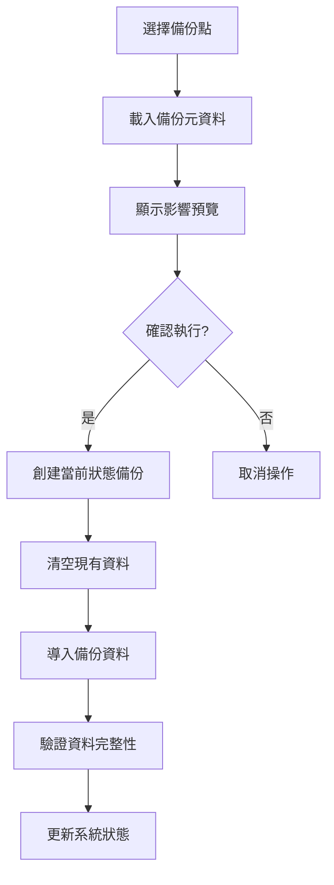
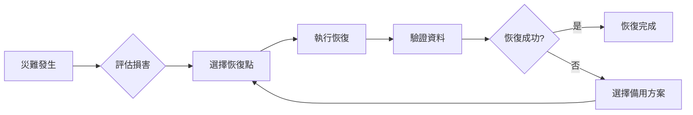

# 🔒 德科斯特實驗室 - 全專案備份與回滾系統設計

## 📊 系統概況分析

### 現有架構
- **資料庫**：Firebase Firestore（NoSQL）
- **檔案儲存**：Firebase Storage
- **用戶認證**：Firebase Auth
- **應用架構**：Next.js 14 + Firebase Functions
- **部署環境**：Firebase Hosting + Cloud Functions

### Firestore 集合清單
| 集合名稱 | 用途 | 重要性 |
|---------|------|--------|
| materials | 原物料庫存 | 高 |
| fragrances | 香精庫存 | 高 |
| products | 產品目錄 | 高 |
| suppliers | 供應商資訊 | 高 |
| purchase_orders | 採購訂單 | 高 |
| work_orders | 生產工單 | 高 |
| timeEntries | 工時記錄 | 中 |
| users | 使用者檔案 | 高 |
| roles | 角色定義 | 中 |
| globalCart | 全域購物車 | 低 |
| inventory_records | 庫存異動記錄 | 中 |
| material_categories | 物料分類 | 中 |
| product_series | 產品系列 | 中 |
| fragrance_history | 香精變更歷史 | 低 |
| storage_materials | 儲位物料 | 中 |
| storage_locations | 儲位管理 | 中 |

## 🎯 備份系統架構設計

### 系統架構圖
```
┌─────────────────────────────────────────────────────────┐
│                    備份管理介面 (UI)                      │
├─────────────────────────────────────────────────────────┤
│                    備份 API 層                           │
│  ┌─────────────┬──────────────┬────────────────────┐   │
│  │ 創建備份     │  恢復備份      │  備份管理          │   │
│  └─────────────┴──────────────┴────────────────────┘   │
├─────────────────────────────────────────────────────────┤
│                    核心備份引擎                          │
│  ┌──────────┬──────────┬──────────┬──────────────┐    │
│  │Firestore │ Storage  │  Auth    │  Metadata    │    │
│  │  備份    │   備份   │   備份    │    管理      │    │
│  └──────────┴──────────┴──────────┴──────────────┘    │
├─────────────────────────────────────────────────────────┤
│                    儲存層                               │
│  ┌──────────────┬─────────────┬──────────────────┐    │
│  │ Google Cloud │  AWS S3     │  本地下載         │    │
│  │   Storage    │  (備援)     │   (離線)         │    │
│  └──────────────┴─────────────┴──────────────────┘    │
└─────────────────────────────────────────────────────────┘
```

### 模組化設計

#### 1. 核心備份引擎 (`functions/src/api/backup/`)
```typescript
backup-system/
├── core/
│   ├── firestore/
│   │   ├── exporter.ts        // Firestore 導出器
│   │   ├── importer.ts        // Firestore 導入器
│   │   └── validator.ts       // 資料驗證器
│   ├── storage/
│   │   ├── fileBackup.ts      // Storage 檔案備份
│   │   └── fileRestore.ts     // Storage 檔案恢復
│   └── auth/
│       ├── userExport.ts      // 用戶資料導出
│       └── userImport.ts      // 用戶資料導入
├── scheduler/
│   ├── cronJobs.ts           // 排程任務
│   └── scheduler.config.ts   // 排程配置
├── compression/
│   ├── compressor.ts         // 壓縮處理
│   └── encryptor.ts          // 加密處理
└── storage-manager/
    ├── gcsManager.ts         // GCS 管理
    ├── s3Manager.ts          // S3 管理
    └── localManager.ts       // 本地儲存管理
```

#### 2. 備份資料結構
```typescript
// 備份元資料
interface BackupMetadata {
  id: string;                    // 備份唯一識別碼
  name: string;                   // 備份名稱
  description?: string;           // 備份描述
  timestamp: Date;                // 備份時間
  version: string;                // 系統版本
  type: 'full' | 'incremental' | 'manual' | 'scheduled';
  status: 'pending' | 'in_progress' | 'completed' | 'failed';

  // 備份內容
  collections: CollectionBackup[];
  storageFiles: StorageBackup[];
  authUsers: AuthBackup[];

  // 統計資訊
  statistics: {
    documentCount: number;
    fileCount: number;
    userCount: number;
    totalSizeBytes: number;
    compressedSizeBytes: number;
  };

  // 安全資訊
  encryption: {
    enabled: boolean;
    algorithm: 'AES-256-GCM';
    keyId?: string;
  };
  checksum: string;              // SHA-256 校驗和

  // 操作資訊
  createdBy: {
    uid: string;
    email: string;
    role: string;
  };
  restoredCount: number;          // 被恢復次數
  expiresAt?: Date;               // 過期時間
}

// 集合備份結構
interface CollectionBackup {
  name: string;                   // 集合名稱
  documentCount: number;          // 文檔數量
  sizeBytes: number;             // 大小
  lastModified: Date;            // 最後修改時間
  data: any[];                   // 實際資料
}
```

### 三層備份策略

#### 1. 即時備份（Real-time Backup）
- **觸發條件**：
  - 刪除重要資料前（供應商、產品、工單）
  - 大量資料變更前
  - 系統升級前
- **備份範圍**：僅備份即將變更的資料
- **保留時間**：7天

#### 2. 定期備份（Scheduled Backup）
- **頻率配置**：
  - 每日備份：凌晨 2:00（增量）
  - 每週備份：週日凌晨 3:00（完整）
  - 每月備份：月初凌晨 4:00（完整+歸檔）
- **備份範圍**：全系統資料
- **保留策略**：
  - 每日備份保留 7 天
  - 每週備份保留 4 週
  - 每月備份保留 12 個月

#### 3. 手動備份（Manual Backup）
- **觸發方式**：管理員介面一鍵備份
- **備份選項**：
  - 選擇性備份特定集合
  - 自訂備份名稱和描述
  - 設定保留期限
- **使用場景**：
  - 重大更新前
  - 資料遷移前
  - 審計需求

## 🔄 回滾機制設計

### 回滾類型與流程

#### 1. 完整回滾（Full Restore）


#### 2. 部分回滾（Partial Restore）
- **集合級回滾**：僅恢復特定集合
- **文檔級回滾**：恢復特定文檔
- **時間範圍回滾**：恢復特定時間範圍的資料

#### 3. 差異回滾（Differential Restore）
- **智能比對**：比較當前資料與備份資料
- **最小化影響**：僅恢復有差異的部分
- **衝突處理**：提供衝突解決選項

### 安全機制

#### 1. 預覽模式
```typescript
interface RestorePreview {
  backup: BackupMetadata;
  impact: {
    collectionsToRestore: string[];
    documentsToRestore: number;
    documentsToDelete: number;
    documentsToUpdate: number;
    estimatedTime: number;      // 預估時間（秒）
  };
  warnings: string[];
  conflicts: ConflictItem[];
}
```

#### 2. 多重驗證
- **第一層**：用戶身份驗證（Firebase Auth）
- **第二層**：角色權限檢查（僅管理員）
- **第三層**：操作密碼確認
- **第四層**：審計日誌記錄

#### 3. 回滾保護
- **回滾前備份**：自動備份當前狀態
- **回滾歷史**：記錄所有回滾操作
- **回滾的回滾**：支援撤銷上次回滾

## 📋 實施計劃

### 第一階段：基礎建設（5-7天）

#### Week 1: 核心功能開發

**Day 1-2: API 端點建立**
```typescript
// 備份 API
POST   /api/backup/create         // 創建備份
GET    /api/backup/list           // 列出備份
GET    /api/backup/{id}           // 獲取備份詳情
DELETE /api/backup/{id}           // 刪除備份
GET    /api/backup/{id}/download  // 下載備份

// 恢復 API
POST   /api/restore/preview       // 預覽恢復影響
POST   /api/restore/execute       // 執行恢復
GET    /api/restore/history       // 恢復歷史
POST   /api/restore/rollback      // 撤銷恢復
```

**Day 3-4: Firestore 備份模組**
- [ ] 實作全集合導出功能
- [ ] 實作增量備份邏輯
- [ ] 實作資料驗證機制
- [ ] 實作批次處理優化

**Day 5-7: 管理介面開發**
- [ ] 備份列表頁面
- [ ] 備份創建對話框
- [ ] 備份詳情檢視
- [ ] 恢復操作介面

### 第二階段：進階功能（3-4天）

#### Week 2: 自動化與優化

**Day 8-9: Storage 備份**
- [ ] 產品圖片備份
- [ ] 文件附件備份
- [ ] 檔案完整性檢查

**Day 10-11: 自動化系統**
```typescript
// Cloud Scheduler 配置
const schedules = {
  daily: {
    schedule: '0 2 * * *',      // 每日凌晨 2:00
    timeZone: 'Asia/Taipei',
    type: 'incremental'
  },
  weekly: {
    schedule: '0 3 * * 0',      // 週日凌晨 3:00
    timeZone: 'Asia/Taipei',
    type: 'full'
  },
  monthly: {
    schedule: '0 4 1 * *',      // 每月1日凌晨 4:00
    timeZone: 'Asia/Taipei',
    type: 'full',
    archive: true
  }
};
```

### 第三階段：回滾系統（3-4天）

#### Week 2-3: 恢復功能

**Day 12-13: 回滾核心功能**
- [ ] 預覽功能實作
- [ ] 執行回滾邏輯
- [ ] 衝突處理機制

**Day 14-15: 安全與監控**
- [ ] 雙因素認證整合
- [ ] 審計日誌系統
- [ ] 進度追蹤介面

## 🔧 技術實作細節

### 備份檔案格式
```json
{
  "version": "1.0.0",
  "metadata": {
    "id": "backup_20250924_020000",
    "timestamp": "2025-09-24T02:00:00Z",
    "checksum": "sha256:abc123..."
  },
  "data": {
    "firestore": {
      "materials": [...],
      "products": [...],
      "orders": [...]
    },
    "storage": {
      "files": [...]
    },
    "auth": {
      "users": [...]
    }
  }
}
```

### 壓縮與加密
```typescript
// 壓縮配置
const compressionConfig = {
  algorithm: 'gzip',
  level: 9  // 最高壓縮率
};

// 加密配置
const encryptionConfig = {
  algorithm: 'aes-256-gcm',
  keyDerivation: 'pbkdf2',
  iterations: 100000
};
```

### 錯誤處理
```typescript
enum BackupError {
  INSUFFICIENT_PERMISSIONS = 'INSUFFICIENT_PERMISSIONS',
  BACKUP_NOT_FOUND = 'BACKUP_NOT_FOUND',
  CORRUPTION_DETECTED = 'CORRUPTION_DETECTED',
  STORAGE_QUOTA_EXCEEDED = 'STORAGE_QUOTA_EXCEEDED',
  RESTORE_CONFLICT = 'RESTORE_CONFLICT',
  NETWORK_ERROR = 'NETWORK_ERROR'
}
```

## 💰 成本分析

### 儲存成本預估
| 項目 | 規格 | 月費用 |
|-----|------|--------|
| GCS Standard | 100GB | $2.00 |
| GCS Nearline（30天以上） | 500GB | $5.00 |
| 網路流量 | 10GB | $1.20 |
| Firestore 操作 | 100萬次讀寫 | $0.36 |
| **總計** | - | **~$8.56/月** |

### 成本優化策略
1. **生命週期管理**
   - 30天後自動轉為 Nearline Storage
   - 365天後自動轉為 Archive Storage
   - 自動刪除過期備份

2. **增量備份**
   - 減少重複資料儲存
   - 降低網路傳輸成本

3. **壓縮優化**
   - 平均壓縮率 70-80%
   - 顯著減少儲存空間

## ⚠️ 風險管理

### 風險識別與對策

| 風險類型 | 可能影響 | 預防措施 | 應對方案 |
|---------|---------|---------|---------|
| 資料損壞 | 高 | 校驗和驗證 | 多版本備份 |
| 備份失敗 | 中 | 自動重試機制 | 告警通知 |
| 權限洩露 | 高 | 加密+存取控制 | 定期審計 |
| 恢復失敗 | 高 | 預覽+測試 | 回滾的回滾 |
| 成本超支 | 低 | 配額限制 | 成本告警 |

### 災難恢復計劃


## 🚀 快速開始指南

### 環境需求
- Node.js 20+
- Firebase CLI 14.15+
- 管理員權限

### 初始設定
```bash
# 1. 安裝依賴
cd functions
npm install @google-cloud/firestore
npm install @google-cloud/storage
npm install node-cron
npm install compression
npm install crypto-js

# 2. 設定環境變數
firebase functions:config:set backup.encryption_key="your-secret-key"
firebase functions:config:set backup.gcs_bucket="your-backup-bucket"
firebase functions:config:set backup.s3_bucket="your-s3-bucket"

# 3. 部署函數
npm run build
firebase deploy --only functions:backup,functions:restore
```

### 使用範例
```typescript
// 創建備份
const backup = await createBackup({
  type: 'manual',
  collections: ['materials', 'products'],
  description: '產品更新前備份'
});

// 預覽恢復
const preview = await previewRestore(backupId);
console.log(`將恢復 ${preview.impact.documentsToRestore} 個文檔`);

// 執行恢復
if (confirm('確定要恢復嗎？')) {
  await executeRestore(backupId, {
    password: adminPassword
  });
}
```

## 📊 監控與維護

### 關鍵指標
- **備份成功率**：> 99.9%
- **平均備份時間**：< 5 分鐘
- **恢復成功率**：> 99.5%
- **儲存使用率**：< 80%

### 定期維護
- [ ] 每週檢查備份完整性
- [ ] 每月執行恢復演練
- [ ] 每季清理過期備份
- [ ] 每年更新災難恢復計劃

## 📝 附錄

### A. 命令快速參考
```bash
# 手動備份
npm run backup:create

# 列出備份
npm run backup:list

# 恢復備份
npm run backup:restore <backup-id>

# 驗證備份
npm run backup:verify <backup-id>

# 清理過期備份
npm run backup:cleanup
```

### B. 故障排除
| 問題 | 可能原因 | 解決方案 |
|-----|---------|---------|
| 備份失敗 | 權限不足 | 檢查服務帳號權限 |
| 恢復緩慢 | 資料量大 | 使用批次處理 |
| 校驗失敗 | 資料損壞 | 使用其他備份版本 |

### C. 相關文檔
- [Firebase 備份最佳實踐](https://firebase.google.com/docs/firestore/manage-data/export-import)
- [Google Cloud Storage 文檔](https://cloud.google.com/storage/docs)
- [災難恢復規劃指南](https://cloud.google.com/architecture/dr-scenarios-planning-guide)

---

**文檔版本**: 1.0.0
**最後更新**: 2025-09-24
**作者**: 德科斯特實驗室技術團隊
**狀態**: 待實施