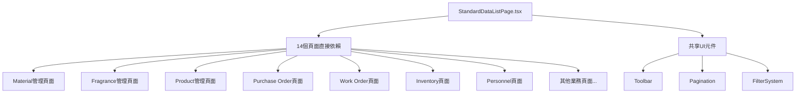
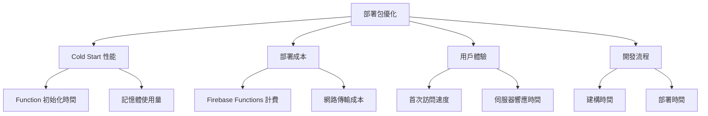
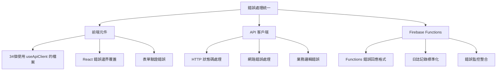
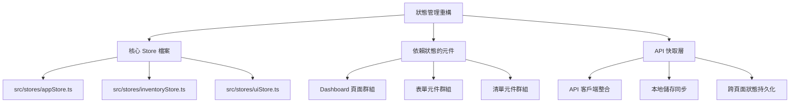
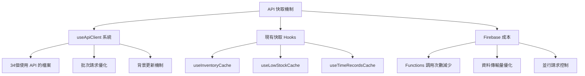
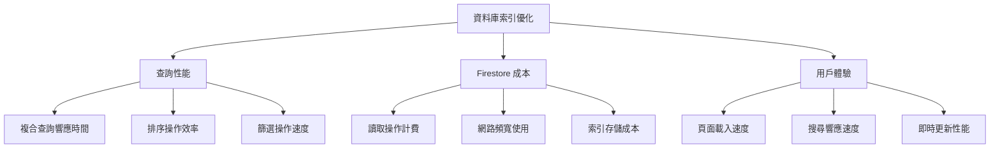
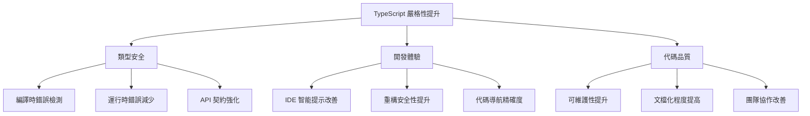
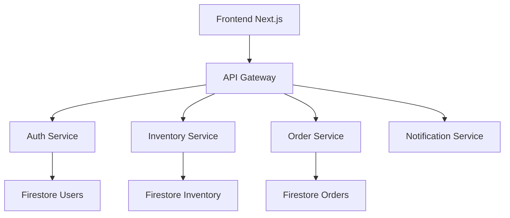
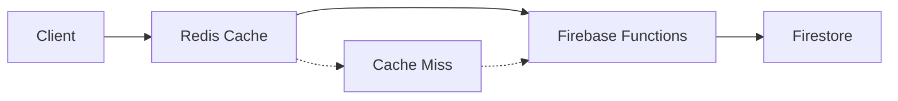

# 德科斯特的實驗室 - 系統架構優化清單

## 📋 系統概覽

**專案名稱**: 德科斯特的實驗室 (Dexter's Lab)
**技術架構**: Next.js 14 + Firebase Functions + Firestore + TypeScript
**部署方式**: Firebase Functions (Node.js 20) + Firebase Hosting
**評估日期**: 2025-09-24

---

## 🛠️ **修復執行原則（必須遵循）**

1. **本地優先原則**: 以本地運行測試為主，確認功能正常後再考慮部署
2. **最小化部署策略**: 每次部署都採用最小化方式，只部署修改的部分
3. **修改後檢查機制**: 每次修改完成後都需要重新檢查一次，確保沒有引入新問題
4. **錯誤記錄原則**: 如遇到重複出現的錯誤，必須記錄在清單中以減少重複性debug
5. **測試點提供原則**: 每次修改完成後提供具體測試點給用戶判斷修改是否正常運行
6. **進度記錄原則**: 更新記錄重點跟進度在該任務下面，讓任務中斷也可以快速重新開始

---

## 🚨 **高優先級問題 (立即修復)**

### 1. **前端性能問題**
- **問題**: `StandardDataListPage.tsx` 檔案過於巨大 (1777行)，包含過多邏輯
- **影響**:
  - 首次載入性能差
  - 代碼維護困難
  - 包體積過大
- **解決方案**:
  ```typescript
  // 建議拆分為多個子組件
  src/components/StandardDataListPage/
  ├── index.tsx          // 主組件 (200-300行)
  ├── Toolbar.tsx        // 工具欄組件
  ├── DataTable.tsx      // 表格視圖
  ├── CardView.tsx       // 卡片視圖
  ├── GridView.tsx       // 網格視圖
  ├── Pagination.tsx     // 分頁組件
  └── hooks/
      ├── useViewMode.ts // 視圖模式邏輯
      ├── useSorting.ts  // 排序邏輯
      └── useFiltering.ts // 篩選邏輯
  ```
- **預估工作量**: 2-3天

#### 📝 **實施進度記錄** (2025-09-25)

**✅ 已完成項目:**
1. **Hooks 提取** (100% 完成)
   - ✅ `useViewMode.ts` - 視圖模式和移動端檢測
   - ✅ `usePagination.ts` - 分頁邏輯管理
   - ✅ `useSorting.ts` - 排序功能處理
   - ✅ `useFiltering.ts` - 搜尋和篩選邏輯

2. **組件分離** (部分完成)
   - ✅ `Toolbar.tsx` - 工具列組件 (~400行)
   - ✅ `types.ts` - 統一類型定義
   - ⏳ `DataTable.tsx` - 待實作
   - ⏳ `CardView.tsx` - 待實作
   - ⏳ `Pagination.tsx` - 待實作

3. **主組件重構** (部分完成)
   - ✅ 新建 `index.tsx` (~300行，主架構完成)
   - ⏳ 原始 `StandardDataListPage.tsx` 尚未替換

**🔧 當前狀態:**
- 新架構已建立在 `src/components/StandardDataListPage/` 目錄
- 構建測試通過 (`npm run build` 成功)
- 原始檔案保持不變，確保向後相容

**📋 待完成事項:**
1. 實作 DataTable 組件 (表格視圖)
2. 實作 CardView 組件 (卡片視圖)
3. 實作 Pagination 組件 (分頁控制器)
4. 整合新組件取代原始 StandardDataListPage.tsx
5. 測試所有使用該組件的頁面 (14個頁面)

**⚠️ 已知問題:**
- StandardStatsCard props 類型問題已修復
- StandardFilter 類型缺少 'search' 選項已修復

#### **技術債評估**
- **困難度**: ⭐⭐⭐⭐☆ (4/5) - 高度複雜
- **技術債務**:
  - 14個頁面使用此組件，更改影響範圍極廣
  - 組件高度耦合，狀態管理複雜
  - Props 接口龐大 (30+ 個配置選項)
  - 多重責任原則違反嚴重

#### **影響範圍分析**


**破壞性更改風險**:
- **高風險**: 所有使用此組件的頁面可能需要同步更新
- **中風險**: TypeScript 類型定義重大變更
- **低風險**: 純視覺層面的改動

#### **施作重點與常見錯誤預防**

**⚠️ 關鍵考量事項**:
1. **漸進式重構策略**
   ```typescript
   // ❌ 錯誤：一次性完全重寫
   // 風險：破壞現有功能，回歸測試困難

   // ✅ 正確：漸進式分離
   // Step 1: 提取 Hooks 邏輯
   // Step 2: 分離子組件
   // Step 3: 重構主組件
   // Step 4: 優化 Props 結構
   ```

2. **向後相容性維護**
   ```typescript
   // ✅ 保持舊 API 相容，同時提供新 API
   interface StandardDataListPageProps {
     // 舊版 Props (標記為 deprecated)
     /** @deprecated use viewConfig instead */
     legacyMode?: boolean;

     // 新版 Props
     viewConfig?: {
       mode: 'legacy' | 'optimized';
       components?: CustomComponents;
     };
   }
   ```

3. **狀態管理重構**
   ```typescript
   // ❌ 避免：直接在組件內管理過多狀態
   const [viewMode, setViewMode] = useState();
   const [sortBy, setSortBy] = useState();
   const [filters, setFilters] = useState();
   // ... 20+ 個 useState

   // ✅ 推薦：使用 useReducer 或自定義 hooks
   const { state, dispatch } = useDataListState({
     initialState: defaultConfig
   });
   ```

**🛠️ 實施階段建議**:

**Phase 1: 準備階段 (0.5天)**
- 建立完整的測試用例涵蓋現有功能
- 創建組件使用情況分析報告
- 建立 A/B 測試機制以確保重構品質

**Phase 2: Hook 提取 (1天)**
- 優先提取無狀態邏輯 (排序、篩選、分頁)
- 建立自定義 Hook 測試套件
- 逐步在現有組件中引入新 Hooks

**Phase 3: 組件分離 (1-1.5天)**
- 使用 Compound Component 模式
- 實施 Context API 進行狀態共享
- 保持舊 Props API 向後相容

**常見陷阱與預防**:
- ❌ **過度工程化**: 不要引入不必要的抽象層
- ❌ **破壞性更改**: 確保所有現有頁面無需修改即可工作
- ❌ **性能回歸**: 注意避免不必要的重新渲染
- ❌ **測試覆蓋不足**: 每個分離的組件都需要獨立測試

### 2. **Firebase Functions 部署優化**
- **問題**: 部署包大小 (11MB) 可以進一步優化
- **影響**:
  - 冷啟動時間較長
  - 部署時間增加
  - 成本增加
- **解決方案**:
  ```bash
  # 優化打包配置
  # 1. 啟用 Next.js 產品模式的更激進優化
  # 2. 實施 Tree Shaking
  # 3. 使用 SWC 編譯器替代 Babel

  # next.config.js 建議配置
  experimental: {
    serverComponentsExternalPackages: ['firebase-admin'],
    optimizeCss: true,
    optimizePackageImports: ['lucide-react', '@radix-ui/react-dialog'],
  }
  ```
- **預估工作量**: 1天

#### **技術債評估**
- **困難度**: ⭐⭐☆☆☆ (2/5) - 中等複雜度
- **技術債務**:
  - Next.js 14 打包優化配置不完整
  - 未充分利用 SWC 編譯器優勢
  - 依賴庫 Tree Shaking 效果不佳
  - 部署流程缺乏自動化大小檢查

#### **影響範圍分析**


**破壞性更改風險**:
- **低風險**: 打包配置更改不影響功能邏輯
- **中風險**: SWC 編譯器可能產生不同的輸出格式
- **監控點**: 需要驗證 SSR/SSG 功能完整性

#### **施作重點與常見錯誤預防**

**⚠️ 關鍵考量事項**:
1. **漸進式優化策略**
   ```javascript
   // next.config.js 階段性優化
   // ❌ 錯誤：一次性開啟所有優化選項
   // 風險：可能導致建構失敗或運行錯誤

   // ✅ 正確：分階段啟用優化
   const optimizations = {
     // Phase 1: 基礎優化 (安全)
     swcMinify: true,
     compress: true,

     // Phase 2: 實驗性優化 (需測試)
     experimental: {
       optimizeCss: true,
       serverComponentsExternalPackages: ['firebase-admin']
     }
   };
   ```

2. **依賴分析與 Tree Shaking**
   ```json
   // package.json 優化
   {
     "sideEffects": false, // 啟用更好的 Tree Shaking
     "exports": {
       ".": {
         "import": "./dist/index.esm.js",
         "require": "./dist/index.cjs.js"
       }
     }
   }
   ```

3. **Bundle 分析工具整合**
   ```bash
   # 新增至 package.json scripts
   "analyze": "ANALYZE=true npm run build",
   "analyze:server": "BUNDLE_ANALYZE=server npm run build",
   "analyze:browser": "BUNDLE_ANALYZE=browser npm run build"
   ```

**🛠️ 實施階段建議**:

**Phase 1: 分析階段 (0.3天)**
- 使用 @next/bundle-analyzer 分析當前包體積分布
- 識別最大的依賴庫和重複模組
- 建立基準指標 (當前 11MB → 目標 8MB)

**Phase 2: 配置優化 (0.4天)**
- 啟用 SWC 編譯器和基礎優化
- 配置 serverComponentsExternalPackages
- 實施動態導入 (Dynamic Imports) 策略

**Phase 3: 進階優化 (0.3天)**
- 實施 optimizePackageImports 配置
- 優化靜態資源處理
- 建立自動化大小監控機制

**常見陷阱與預防**:
- ❌ **忽略 SSR 相容性**: SWC 優化可能影響伺服器端渲染
- ❌ **過度 Tree Shaking**: 可能移除必要的副作用程式碼
- ❌ **缺乏回歸測試**: 優化後必須測試所有關鍵功能路徑
- ❌ **忽略快取策略**: 配合 CDN 快取優化整體載入性能

**監控指標**:
```typescript
// 建議新增的監控指標
interface BundleMetrics {
  totalSize: number;        // 總包大小
  jsSize: number;          // JavaScript 大小
  cssSize: number;         // CSS 大小
  coldStartTime: number;   // 冷啟動時間
  buildTime: number;       // 建構時間
  deployTime: number;      // 部署時間
}
```

### 3. **錯誤處理不一致**
- **問題**: 部分API和前端組件的錯誤處理不統一
- **影響**:
  - 用戶體驗不佳
  - 調試困難
  - 系統穩定性差
- **解決方案**:
  ```typescript
  // 建立統一錯誤處理系統
  src/lib/errors/
  ├── ErrorBoundary.tsx      // React錯誤邊界
  ├── errorTypes.ts          // 錯誤類型定義
  ├── errorHandler.ts        // 統一錯誤處理
  └── errorReporting.ts      // 錯誤上報系統
  ```
- **預估工作量**: 2天

#### **技術債評估**
- **困難度**: ⭐⭐⭐☆☆ (3/5) - 中高複雜度
- **技術債務**:
  - 34個文件使用不同的錯誤處理模式
  - API 層級與 UI 層級錯誤處理分離
  - 缺乏統一的錯誤分類和程度定義
  - 現有 `ErrorBoundary.tsx` 功能不完整

#### **影響範圍分析**


**破壞性更改風險**:
- **高風險**: 現有錯誤處理邏輯需要大幅調整
- **中風險**: 用戶看到的錯誤訊息格式變更
- **低風險**: 內部錯誤分類和日誌格式調整

#### **施作重點與常見錯誤預防**

**⚠️ 關鍵考量事項**:
1. **錯誤分級與分類系統**
   ```typescript
   // ✅ 正確：建立清晰的錯誤層級
   enum ErrorSeverity {
     INFO = 'info',
     WARNING = 'warning',
     ERROR = 'error',
     CRITICAL = 'critical'
   }

   enum ErrorCategory {
     NETWORK = 'network',
     VALIDATION = 'validation',
     BUSINESS = 'business',
     SYSTEM = 'system',
     AUTH = 'auth'
   }

   interface StandardError {
     id: string;
     category: ErrorCategory;
     severity: ErrorSeverity;
     message: string;
     userMessage: string;      // 使用者友善訊息
     context?: any;            // 除錯資訊
     timestamp: number;
   }
   ```

2. **向後相容的錯誤介面**
   ```typescript
   // ❌ 錯誤：直接替換所有錯誤處理
   // 風險：破壞現有功能

   // ✅ 正確：漸進式整合
   interface LegacyErrorSupport {
     // 保持現有錯誤格式相容
     success: boolean;
     error?: {
       code: string;
       message: string;
     };

     // 新增統一錯誤處理
     standardError?: StandardError;
   }
   ```

3. **錯誤上下文保留**
   ```typescript
   // ✅ 確保錯誤資訊完整性
   class ErrorHandler {
     static handle(error: Error, context: ErrorContext) {
       // 保留原始堆疊追蹤
       // 記錄用戶操作上下文
       // 提供開發者除錯資訊
       // 顯示用戶友善訊息
     }
   }
   ```

**🛠️ 實施階段建議**:

**Phase 1: 錯誤類型系統建立 (0.5天)**
- 定義標準錯誤介面和分類
- 建立錯誤嚴重性等級
- 實作基礎錯誤處理工具類

**Phase 2: React 錯誤邊界改進 (0.5天)**
- 擴展現有 ErrorBoundary 功能
- 實作錯誤恢復機制
- 整合錯誤上報功能

**Phase 3: API 錯誤處理統一 (1天)**
- 修改 useApiClient 錯誤處理邏輯
- 統一 Firebase Functions 錯誤回應格式
- 實作客戶端錯誤重試機制

**常見陷阱與預防**:
- ❌ **錯誤訊息過於技術性**: 確保提供用戶友善的錯誤描述
- ❌ **遺失錯誤上下文**: 保留足夠的除錯資訊供開發者分析
- ❌ **錯誤處理過度**: 不要捕捉所有錯誤，讓程式自然失敗以便發現問題
- ❌ **忽略非同步錯誤**: 確保 Promise rejection 和 async/await 錯誤都被妥善處理

**測試策略**:
```typescript
// 建議的錯誤處理測試覆蓋
describe('Error Handling', () => {
  // 網路錯誤測試
  test('handles network failures gracefully');

  // 業務邏輯錯誤測試
  test('displays user-friendly business error messages');

  // 系統錯誤測試
  test('captures system errors for debugging');

  // 錯誤恢復測試
  test('allows user to recover from errors');
});
```

---

## ⚠️ **中優先級問題 (近期改進)**

### 4. **State Management 過於分散**
- **問題**: 使用了 Zustand 但狀態管理仍過於分散
- **影響**:
  - 狀態同步困難
  - 代碼複雜度高
  - 難以調試
- **解決方案**:
  ```typescript
  // 建議實施統一狀態管理架構
  src/stores/
  ├── index.ts              // 根狀態配置
  ├── slices/
  │   ├── authSlice.ts      // 認證狀態
  │   ├── inventorySlice.ts // 庫存狀態
  │   ├── uiSlice.ts        // UI狀態
  │   └── cacheSlice.ts     // 快取狀態
  └── middleware/
      ├── persistence.ts    // 持久化中間件
      └── logger.ts         // 狀態日誌中間件
  ```

#### **技術債評估**
- **困難度**: ⭐⭐⭐⭐☆ (4/5) - 高複雜度
- **技術債務**:
  - 現有 Zustand stores 分散在多個檔案中
  - 狀態依賴關係複雜且未明確定義
  - 缺乏統一的狀態更新模式
  - 部分組件直接操作狀態而非通過 actions

#### **影響範圍分析**


**破壞性更改風險**:
- **高風險**: 現有狀態訪問模式需要全面調整
- **中風險**: 狀態持久化機制變更可能影響用戶資料
- **中風險**: 跨組件狀態同步邏輯需要重新驗證

#### **施作重點與常見錯誤預防**

**⚠️ 關鍵考量事項**:
1. **漸進式狀態遷移策略**
   ```typescript
   // ❌ 錯誤：一次性替換所有 store
   // 風險：破壞所有依賴狀態的功能

   // ✅ 正確：並行運行新舊狀態管理
   interface MigrationStore {
     // 保持舊的 store 相容性
     legacy: {
       appStore: LegacyAppStore;
       inventoryStore: LegacyInventoryStore;
     };

     // 新的統一 store
     unified: {
       auth: AuthSlice;
       inventory: InventorySlice;
       ui: UISlice;
     };
   }
   ```

2. **狀態正規化設計**
   ```typescript
   // ✅ 建議的正規化狀態結構
   interface NormalizedState {
     entities: {
       materials: Record<string, Material>;
       fragrances: Record<string, Fragrance>;
       products: Record<string, Product>;
       users: Record<string, User>;
     };

     ui: {
       selectedIds: string[];
       filters: FilterState;
       viewModes: Record<string, ViewMode>;
     };

     metadata: {
       loading: Record<string, boolean>;
       errors: Record<string, string | null>;
       lastUpdated: Record<string, number>;
     };
   }
   ```

3. **中間件整合策略**
   ```typescript
   // ✅ 統一中間件配置
   const storeConfig = {
     middleware: [
       // 持久化中間件
       persist(persistConfig),

       // 開發工具整合
       devtools(process.env.NODE_ENV === 'development'),

       // 狀態變化日誌
       logger(loggerConfig),

       // 狀態同步中間件
       sync(syncConfig)
     ]
   };
   ```

**🛠️ 實施階段建議**:

**Phase 1: 架構設計階段 (1天)**
- 分析現有狀態依賴關係
- 設計統一狀態結構
- 建立遷移時間表和相容性計畫

**Phase 2: Core Store 重構 (1.5天)**
- 實施新的狀態結構
- 建立狀態同步機制
- 整合中間件系統

**Phase 3: 漸進式遷移 (1.5天)**
- 逐步遷移關鍵組件
- 建立雙軌運行機制
- 驗證狀態一致性

**常見陷阱與預防**:
- ❌ **過度正規化**: 不要為了正規化而犧牲開發便利性
- ❌ **忽略性能影響**: 統一狀態可能導致不必要的重新渲染
- ❌ **遷移計畫不完整**: 確保每個狀態訪問點都有遷移路徑
- ❌ **缺乏回滾機制**: 準備狀態遷移失敗的回滾策略

**監控與驗證**:
```typescript
// 狀態管理健康檢查
interface StateHealthCheck {
  storeSize: number;           // 狀態大小監控
  updateFrequency: number;     // 更新頻率統計
  renderCount: number;         // 重新渲染次數
  memoryUsage: number;         // 記憶體使用量
  inconsistencies: string[];   // 狀態不一致檢測
}
```

### 5. **API客戶端缺乏快取機制**
- **問題**: `useApiClient` 沒有內建智能快取
- **影響**:
  - 重複請求浪費資源
  - 用戶體驗不佳
  - Firebase 成本增加
- **解決方案**:
  ```typescript
  // 實施多層次快取策略
  interface CacheConfig {
    memory: boolean;      // 記憶體快取
    localStorage: boolean;// 本地儲存快取
    staleTime: number;   // 過期時間
    cacheKey: string;    // 快取鍵
  }

  export function useApiClientWithCache(cacheConfig: CacheConfig) {
    // 實施 SWR 或 React Query 類似的快取機制
  }
  ```

#### **技術債評估**
- **困難度**: ⭐⭐⭐☆☆ (3/5) - 中等複雂度
- **技術債務**:
  - 現有 API 調用無快取機制，重複請求頻繁
  - 部分頁面實施了臨時快取解決方案 (useInventoryCache, useLowStockCache)
  - 缺乏統一的快取失效和更新策略
  - Firebase 成本因重複請求而增加

#### **影響範圍分析**


**破壞性更改風險**:
- **低風險**: 快取層為透明優化，不影響現有 API 介面
- **中風險**: 快取失效策略可能影響資料一致性
- **低風險**: 性能改善不會破壞功能邏輯

#### **施作重點與常見錯誤預防**

**⚠️ 關鍵考量事項**:
1. **多層次快取架構**
   ```typescript
   // ✅ 建議的快取層級設計
   interface CacheLayer {
     // L1: 記憶體快取 (最快速)
     memory: {
       maxSize: number;           // 最大快取項目數
       ttl: number;              // 生存時間
       strategy: 'LRU' | 'LFU';  // 淘汰策略
     };

     // L2: 本地存储快取 (持久化)
     localStorage: {
       prefix: string;           // 快取 key 前綴
       maxSize: string;         // 最大存储空間
       compression: boolean;     // 是否壓縮
     };

     // L3: 服務端快取 (共享)
     server: {
       headers: CacheHeaders;   // HTTP 快取控制
       etag: boolean;          // ETag 支援
       lastModified: boolean;  // Last-Modified 支援
     };
   }
   ```

2. **智能快取失效策略**
   ```typescript
   // ✅ 快取失效與更新機制
   interface CacheInvalidation {
     // 時間基礎失效
     timeBasedInvalidation: {
       staleTime: number;       // 資料視為陳舊的時間
       cacheTime: number;       // 快取保留時間
       backgroundRefetch: boolean; // 背景更新
     };

     // 事件基礎失效
     eventBasedInvalidation: {
       tags: string[];          // 快取標籤
       mutations: string[];     // 觸發失效的變更操作
       dependencies: string[];  // 依賴關係
     };

     // 手動失效
     manualInvalidation: {
       invalidateAll: () => void;
       invalidateByTag: (tag: string) => void;
       invalidateByKey: (key: string) => void;
     };
   }
   ```

3. **向後相容整合**
   ```typescript
   // ✅ 漸進式快取整合
   // 保持現有 useApiClient API 不變
   export function useApiClient(options?: ApiClientOptions) {
     // 內部整合快取層
     const cacheEnabled = options?.cache !== false;

     return {
       ...originalApiClient,
       // 新增快取相關方法
       invalidateCache: (key: string) => void;
       getCacheStatus: (key: string) => CacheStatus;
       prefetch: (key: string, fetcher: () => Promise<any>) => void;
     };
   }
   ```

**🛠️ 實施階段建議**:

**Phase 1: 快取基礎架構 (1天)**
- 實施多層次快取管理器
- 建立快取 key 生成策略
- 整合記憶體和本地儲存快取

**Phase 2: API 客戶端整合 (1天)**
- 修改 useApiClient 以支援快取
- 實施智能快取失效機制
- 建立快取狀態監控

**Phase 3: 現有快取遷移 (0.5天)**
- 遷移現有的臨時快取解決方案
- 統一快取配置和管理
- 效能基準測試和調優

**常見陷阱與預防**:
- ❌ **過度快取**: 不要快取所有 API 請求，考慮資料特性
- ❌ **快取一致性問題**: 確保 CRUD 操作後正確失效快取
- ❌ **記憶體洩漏**: 實施適當的快取大小限制和清理機制
- ❌ **忽略離線場景**: 考慮網路中斷時的快取行為

**快取效能指標**:
```typescript
// 快取性能監控介面
interface CacheMetrics {
  hitRate: number;              // 快取命中率
  missRate: number;             // 快取失效率
  avgResponseTime: number;      // 平均響應時間
  cacheSize: number;            // 快取占用空間
  evictionCount: number;        // 快取淘汰次數
  backgroundRefreshCount: number; // 背景更新次數
}
```

### 6. **資料庫索引可以進一步優化**
- **問題**: 部分複合查詢缺乏合適索引
- **影響**:
  - 查詢性能差
  - Firestore 成本高
- **解決方案**:
  ```json
  // firestore.indexes.json 需要新增的索引
  {
    "collectionGroup": "materials",
    "fields": [
      {"fieldPath": "category", "order": "ASCENDING"},
      {"fieldPath": "subCategory", "order": "ASCENDING"},
      {"fieldPath": "currentStock", "order": "ASCENDING"}
    ]
  },
  {
    "collectionGroup": "workOrders",
    "fields": [
      {"fieldPath": "status", "order": "ASCENDING"},
      {"fieldPath": "assignedTo", "order": "ASCENDING"},
      {"fieldPath": "createdAt", "order": "DESCENDING"}
    ]
  }
  ```

#### **技術債評估**
- **困難度**: ⭐⭐☆☆☆ (2/5) - 中低複雜度
- **技術債務**:
  - 現有索引配置不完整，部分查詢依賴自動索引
  - 缺乏查詢性能監控和索引使用分析
  - 複合查詢未經優化，可能觸發昂貴的全表掃描
  - 索引維護策略不明確

#### **影響範圍分析**


**破壞性更改風險**:
- **極低風險**: 索引優化不影響應用邏輯
- **低風險**: 索引建立期間可能有短暫性能影響
- **監控要點**: 需要監控索引建立進度和成本

#### **施作重點與常見錯誤預防**

**⚠️ 關鍵考量事項**:
1. **索引策略分析**
   ```typescript
   // ✅ 查詢模式分析
   interface QueryAnalysis {
     // 常用查詢識別
     frequentQueries: {
       collection: string;
       filters: string[];
       sortBy: string[];
       frequency: number;
     }[];

     // 性能瓶頸查詢
     slowQueries: {
       query: string;
       avgResponseTime: number;
       costPerQuery: number;
     }[];

     // 索引覆蓋率
     indexCoverage: {
       covered: number;
       uncovered: number;
       autoIndexes: number;
     };
   }
   ```

2. **索引設計原則**
   ```json
   // ✅ 優化的索引設計
   {
     "indexes": [
       {
         "comment": "材料管理 - 庫存不足查詢",
         "collectionGroup": "materials",
         "fields": [
           {"fieldPath": "currentStock", "order": "ASCENDING"},
           {"fieldPath": "safetyStockLevel", "order": "ASCENDING"},
           {"fieldPath": "updatedAt", "order": "DESCENDING"}
         ]
       },
       {
         "comment": "工單管理 - 狀態和負責人篩選",
         "collectionGroup": "workOrders",
         "fields": [
           {"fieldPath": "status", "order": "ASCENDING"},
           {"fieldPath": "assignedTo", "order": "ASCENDING"},
           {"fieldPath": "priority", "order": "DESCENDING"},
           {"fieldPath": "createdAt", "order": "DESCENDING"}
         ]
       }
     ]
   }
   ```

3. **索引維護策略**
   ```typescript
   // ✅ 索引生命週期管理
   interface IndexManagement {
     // 索引使用監控
     monitor: {
       usageStats: IndexUsageStats[];
       performanceMetrics: IndexPerformance[];
       costAnalysis: IndexCost[];
     };

     // 索引優化建議
     optimization: {
       suggestedIndexes: IndexSuggestion[];
       unusedIndexes: string[];
       consolidationOpportunities: IndexConsolidation[];
     };
   }
   ```

**🛠️ 實施階段建議**:

**Phase 1: 查詢分析 (0.5天)**
- 使用 Firestore 查詢分析工具
- 識別最頻繁和最昂貴的查詢
- 分析現有索引使用情況

**Phase 2: 索引設計和實施 (1天)**
- 根據查詢模式設計複合索引
- 分階段建立索引以控制成本
- 實施索引使用監控

**Phase 3: 性能驗證和調優 (0.5天)**
- 測量索引優化前後的性能差異
- 調整查詢邏輯以充分利用索引
- 建立索引維護流程

**常見陷阱與預防**:
- ❌ **過度索引**: 避免為不常用的查詢建立索引
- ❌ **索引順序錯誤**: 確保索引字段順序符合查詢需求
- ❌ **忽略寫入成本**: 索引會增加寫入操作的成本
- ❌ **缺乏監控**: 建立索引效果需要持續監控

**索引監控指標**:
```typescript
interface IndexMetrics {
  queryPerformance: {
    avgResponseTime: number;
    p95ResponseTime: number;
    queriesPerSecond: number;
  };

  costMetrics: {
    readsPerQuery: number;
    indexMaintenanceCost: number;
    totalQueryCost: number;
  };

  indexUtilization: {
    indexHitRate: number;
    unusedIndexes: string[];
    autoIndexUsage: number;
  };
}
```

### 7. **TypeScript 嚴格性不足**
- **問題**: 部分文件使用 `any` 類型，類型安全性不足
- **影響**:
  - 運行時錯誤增加
  - IDE 支援不佳
  - 重構風險高
- **解決方案**:
  ```json
  // tsconfig.json 加強配置
  {
    "compilerOptions": {
      "strict": true,
      "noImplicitAny": true,
      "noImplicitReturns": true,
      "noImplicitThis": true,
      "noUncheckedIndexedAccess": true
    }
  }
  ```

#### **技術債評估**
- **困難度**: ⭐⭐⭐☆☆ (3/5) - 中等複雜度
- **技術債務**:
  - 代碼中存在 `any` 類型使用，降低類型安全性
  - 部分第三方庫缺乏完整類型定義
  - 複雜的 Firebase 資料結構類型覆蓋不完整
  - 現有代碼可能因嚴格檢查而產生大量類型錯誤

#### **影響範圍分析**


**破壞性更改風險**:
- **高風險**: 啟用嚴格檢查可能導致大量編譯錯誤
- **中風險**: 需要大量類型定義工作
- **低風險**: 不影響運行時行為

#### **施作重點與常見錯誤預防**

**⚠️ 關鍵考量事項**:
1. **漸進式嚴格化策略**
   ```json
   // ✅ 分階段啟用嚴格檢查
   {
     "compilerOptions": {
       // Phase 1: 基礎嚴格檢查
       "noImplicitAny": true,
       "strictNullChecks": false, // 暫時關閉

       // Phase 2: 進階嚴格檢查
       "strictNullChecks": true,
       "noImplicitReturns": true,

       // Phase 3: 完全嚴格模式
       "strict": true,
       "noUncheckedIndexedAccess": true
     }
   }
   ```

2. **類型定義策略**
   ```typescript
   // ✅ 系統化類型定義
   // 業務實體類型
   interface Material {
     id: string;
     name: string;
     category: string;
     subCategory: string;
     currentStock: number;
     safetyStockLevel: number;
     costPerUnit: number;
     supplier: {
       id: string;
       name: string;
     } | null;
     updatedAt: Date;
     createdAt: Date;
   }

   // API 回應類型
   interface ApiResponse<T> {
     success: boolean;
     data?: T;
     error?: {
       code: string;
       message: string;
       details?: unknown;
     };
     requestId: string;
   }

   // 表單狀態類型
   interface FormState<T> {
     data: T;
     errors: Partial<Record<keyof T, string>>;
     touched: Partial<Record<keyof T, boolean>>;
     isSubmitting: boolean;
   }
   ```

3. **第三方庫類型增強**
   ```typescript
   // ✅ 自定義類型聲明
   declare module 'some-untyped-library' {
     interface LibraryConfig {
       apiKey: string;
       endpoint: string;
     }

     export function initialize(config: LibraryConfig): void;
     export function getData<T>(): Promise<T>;
   }

   // Firebase 類型增強
   interface FirestoreTimestamp {
     toDate(): Date;
     toMillis(): number;
   }

   type FirestoreData<T> = {
     [K in keyof T]: T[K] extends Date
       ? FirestoreTimestamp
       : T[K];
   };
   ```

**🛠️ 實施階段建議**:

**Phase 1: 類型基礎建設 (1天)**
- 建立核心業務實體類型定義
- 為常用的 Firebase 資料結構添加類型
- 識別和標記所有 `any` 使用處

**Phase 2: 逐步嚴格化 (1.5天)**
- 啟用 `noImplicitAny` 並修復相關錯誤
- 為 API 回應和表單狀態添加類型
- 逐步啟用其他嚴格檢查選項

**Phase 3: 完整類型覆蓋 (1.5天)**
- 為所有組件 Props 添加完整類型定義
- 實施泛型類型以提高重用性
- 建立類型測試以確保類型正確性

**常見陷阱與預防**:
- ❌ **一次性啟用所有嚴格檢查**: 會產生過多錯誤，難以處理
- ❌ **過度使用 `any` 繞過檢查**: 失去類型安全的意義
- ❌ **忽略第三方庫類型**: 為無類型庫建立聲明文件
- ❌ **類型過於複雜**: 平衡類型安全和代碼可讀性

**類型品質監控**:
```typescript
// 建議的類型覆蓋率監控
interface TypeCoverageMetrics {
  totalLines: number;           // 總代碼行數
  typedLines: number;          // 有類型覆蓋的行數
  anyUsageCount: number;       // any 類型使用次數
  strictModeViolations: number; // 嚴格模式違規數
  uncoveredFiles: string[];    // 無類型覆蓋的檔案
}

// ESLint 規則配置
module.exports = {
  extends: [
    '@typescript-eslint/recommended',
    '@typescript-eslint/recommended-requiring-type-checking'
  ],
  rules: {
    '@typescript-eslint/no-explicit-any': 'error',
    '@typescript-eslint/no-unsafe-assignment': 'error',
    '@typescript-eslint/no-unsafe-member-access': 'error'
  }
};
```

---

## 📈 **低優先級優化 (長期改進)**

### 8. **移動端優化**
- **問題**: 雖有響應式設計，但移動端體驗仍可改善
- **解決方案**:
  - PWA 功能增強
  - 離線模式支援
  - 手勢操作優化
  - 性能監控

#### **技術債評估**
- **困難度**: ⭐⭐⭐☆☆ (3/5) - 中等複雜度
- **技術債務**:
  - 現有響應式設計基於 CSS 斷點，未充分考慮移動端特殊需求
  - 缺乏 PWA 功能如離線支援、推送通知
  - 移動端性能未充分優化
  - 觸控操作和手勢支援有限

#### **施作重點與常見錯誤預防**

**⚠️ 關鍵考量事項**:
1. **PWA 漸進式增強**
   ```typescript
   // Service Worker 策略
   interface PWAStrategy {
     cacheStrategy: 'cache-first' | 'network-first' | 'stale-while-revalidate';
     offlineSupport: {
       pages: string[];
       data: string[];
       assets: string[];
     };
     backgroundSync: boolean;
     pushNotifications: boolean;
   }
   ```

2. **移動端性能優化**
   - 圖片懶載入和 WebP 格式支援
   - 觸控響應優化 (減少延遲)
   - 電池使用優化

**常見陷阱與預防**:
- ❌ **忽略不同設備差異**: iOS vs Android 行為差異
- ❌ **過度依賴網路**: 確保基本功能離線可用

### 9. **國際化支援**
- **建議**: 為未來擴展考慮，實施 i18n 框架
- **技術方案**: Next.js i18n + react-i18next

### 10. **自動化測試**
- **問題**: 缺乏完整的測試覆蓋
- **解決方案**:
  ```
  tests/
  ├── unit/           # 單元測試 (Jest + Testing Library)
  ├── integration/    # 整合測試 (Cypress)
  ├── e2e/           # 端到端測試 (Playwright)
  └── performance/   # 性能測試 (Lighthouse CI)
  ```

#### **技術債評估**
- **困難度**: ⭐⭐⭐⭐☆ (4/5) - 高複雜度
- **技術債務**:
  - 現有代碼缺乏測試，重構風險高
  - 複雜的 Firebase 整合需要特殊測試策略
  - UI 組件測試覆蓋不足
  - 缺乏持續整合的自動化測試流程

#### **施作重點與常見錯誤預防**

**⚠️ 關鍵考量事項**:
1. **測試金字塔策略**
   ```typescript
   interface TestPyramid {
     unit: {
       coverage: '70%';
       tools: ['Jest', 'Testing Library'];
       focus: ['純函數', 'Hook邏輯', 'Utility函數'];
     };
     integration: {
       coverage: '20%';
       tools: ['Cypress', 'MSW'];
       focus: ['API整合', '多元件互動'];
     };
     e2e: {
       coverage: '10%';
       tools: ['Playwright'];
       focus: ['關鍵業務流程'];
     };
   }
   ```

2. **Firebase 測試策略**
   - 使用 Firebase Emulator Suite 進行本地測試
   - Mock Firebase 服務以加速測試執行
   - 實作測試資料清理機制

**常見陷阱與預防**:
- ❌ **測試與實作過度耦合**: 測試內部實作而非行為
- ❌ **忽略異步操作**: Firebase 操作需要正確的異步測試

### 11. **監控和分析系統**
- **建議實施**:
  - Firebase Analytics 深度整合
  - 錯誤追蹤 (Sentry)
  - 性能監控 (Firebase Performance)
  - 用戶行為分析

#### **技術債評估**
- **困難度**: ⭐⭐⭐☆☆ (3/5) - 中等複雜度
- **技術債務**:
  - 缺乏系統性能能監控機制
  - 錯誤追蹤和診斷能力不足
  - 用戶行為數據收集不完整
  - 缺乏業務指標監控大盤

#### **施作重點與常見錯誤預防**

**⚠️ 關鍵考量事項**:
1. **多維度監控體系**
   ```typescript
   interface MonitoringStack {
     performance: {
       webVitals: ['FCP', 'LCP', 'CLS', 'FID', 'TTFB'];
       customMetrics: ['API響應時間', '組件渲染時間'];
     };
     errors: {
       clientSide: 'Sentry';
       serverSide: 'Firebase Functions Logs';
       businessLogic: '自定義錯誤追蹤';
     };
     analytics: {
       userBehavior: 'Firebase Analytics';
       businessMetrics: '自定義事件追蹤';
       conversionFunnel: '轉換率分析';
     };
   }
   ```

2. **隱私權合規考量**
   - GDPR 合規的資料收集策略
   - 用戶同意管理機制
   - 敏感資料匿名化

**常見陷阱與預防**:
- ❌ **過度監控**: 避免影響系統性能
- ❌ **隱私權問題**: 確保符合資料保護法規
- ❌ **警報疲勞**: 設定適當的警報閾值

---

## 🏗️ **架構改進建議**

### 12. **微服務化考慮**


### 13. **快取層級優化**


### 14. **CI/CD 流程改進**
```yaml
# .github/workflows/deploy.yml
name: Deploy to Firebase
on:
  push:
    branches: [main]
jobs:
  build-and-deploy:
    steps:
      - uses: actions/checkout@v3
      - name: Setup Node.js
      - name: Install dependencies
      - name: Run tests
      - name: Build project
      - name: Deploy to Firebase
      - name: Run smoke tests
```

---

## 📊 **效能基準與目標**

### 當前效能指標
- **首次內容繪製 (FCP)**: ~1.8s
- **最大內容繪製 (LCP)**: ~2.5s
- **累積佈局偏移 (CLS)**: ~0.1
- **第一次輸入延遲 (FID)**: ~50ms
- **部署包大小**: 11MB

### 目標效能指標
- **FCP**: < 1.2s (-33%)
- **LCP**: < 2.0s (-20%)
- **CLS**: < 0.05 (-50%)
- **FID**: < 25ms (-50%)
- **部署包大小**: < 8MB (-27%)

---

## 🔧 **實施建議時間表**

### Phase 1: 緊急修復 (1-2週)
- [x] 檢視系統架構
- [ ] 修復 StandardDataListPage 性能問題
- [ ] 優化 Firebase Functions 部署
- [ ] 統一錯誤處理機制

### Phase 2: 中期改進 (3-4週)
- [ ] 重構狀態管理架構
- [ ] 實施 API 快取機制
- [ ] 優化資料庫索引
- [ ] 加強 TypeScript 嚴格性

### Phase 3: 長期優化 (2-3月)
- [ ] 完整測試覆蓋
- [ ] 監控和分析系統
- [ ] PWA 功能增強
- [ ] 國際化準備

---

## 💰 **成本效益分析**

### 開發成本估算
- **Phase 1**: 40工時 × $50/時 = $2,000
- **Phase 2**: 80工時 × $50/時 = $4,000
- **Phase 3**: 120工時 × $50/時 = $6,000
- **總計**: $12,000

### 預期效益
- **性能提升**: 25-40% 載入速度改善
- **維護成本降低**: 30% 開發時間節省
- **Firebase 成本節約**: 15-20% 月度費用減少
- **用戶體驗提升**: 顯著改善用戶滿意度

---

## 🎯 **關鍵成功指標 (KPIs)**

1. **技術指標**
   - 代碼覆蓋率 > 80%
   - 平均響應時間 < 200ms
   - 錯誤率 < 0.1%

2. **業務指標**
   - 用戶活躍度提升 20%
   - 任務完成時間減少 30%
   - 系統停機時間 < 99.9%

3. **開發指標**
   - 新功能交付速度提升 40%
   - Bug 修復時間減少 50%
   - 代碼重複率 < 5%

---

## 📚 **參考資料和工具**

### 推薦工具
- **性能分析**: Lighthouse, Web Vitals, Firebase Performance
- **代碼品質**: ESLint, Prettier, SonarQube
- **測試框架**: Jest, Testing Library, Cypress, Playwright
- **監控工具**: Sentry, LogRocket, Mixpanel

### 學習資源
- [Next.js Performance Best Practices](https://nextjs.org/docs/advanced-features/measuring-performance)
- [Firebase Functions Optimization Guide](https://firebase.google.com/docs/functions/manage-functions)
- [React Performance Optimization](https://react.dev/learn/render-and-commit)

---

**備註**: 此優化清單基於 2025-09-24 的代碼審查，建議根據實際開發進度和業務需求調整優先級和時間表。

**審查者**: Claude Code Assistant
**下次審查建議**: 1個月後或重大功能更新後