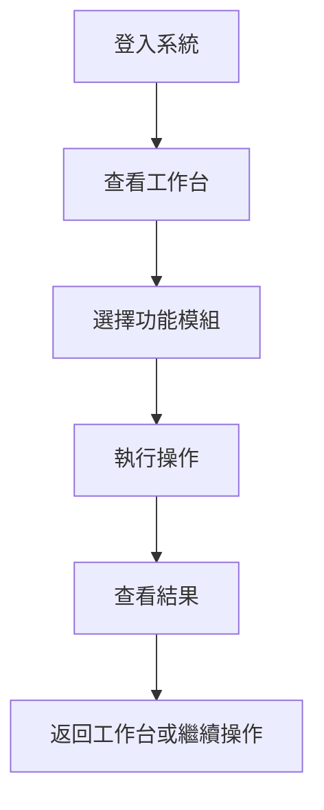

# 鹿鹿小作坊 (Deer Lab) 系統說明書

**版本**: 1.0  
**更新時間**: 2025年9月2日  
**系統定位**: 全方位生產管理系統  

---

## 📖 目錄

1. [系統概述](#系統概述)
2. [快速開始](#快速開始)
3. [系統架構](#系統架構)
4. [功能模組詳解](#功能模組詳解)
5. [權限系統](#權限系統)
6. [操作流程指南](#操作流程指南)
7. [常見問題](#常見問題)
8. [開發者指南](#開發者指南)

---

## 📋 系統概述

「鹿鹿小作坊」是專為小型製造工坊設計的全方位生產管理系統，整合了庫存、採購、工單、成本和人力資源管理功能。系統採用現代化架構，具備即時同步、權限控制和響應式設計等特性。

### 🎯 核心價值

- **一站式管理**: 涵蓋生產流程的所有環節
- **即時協作**: 支援多裝置即時數據同步
- **權限控制**: 三級角色權限系統確保數據安全
- **智能分析**: 自動統計分析和預警功能
- **行動優先**: 完整支援手機和平板操作

### 💡 適用對象

- **系統管理員**: 全權管理系統和人員
- **生產領班**: 管理生產流程和物料
- **計時人員**: 記錄工時和查看基本資訊

---

## 🚀 快速開始

### 第一次登入

1. **訪問系統**: 開啟瀏覽器前往系統網址
2. **登入認證**: 使用提供的帳號密碼登入
3. **查看權限**: 系統會根據您的角色顯示可用功能

### 基本操作流程



### 常用快捷操作

| 功能 | 快捷路徑 | 說明 |
|------|----------|------|
| 工時記錄 | 工作台 → 我的工時 | 查看個人工時統計 |
| 庫存查詢 | 生產中心 → 庫存監控 | 即時庫存狀況 |
| 採購管理 | 供應鏈 → 採購訂單 | 管理採購流程 |
| 工單管理 | 生產中心 → 生產工單 | 生產任務管理 |

---

## 🏗️ 系統架構

### 技術堆疊

```
前端層     │ Next.js 14 + React 18 + TypeScript
UI層       │ Radix UI + Tailwind CSS + Lucide Icons  
狀態管理   │ React Context + Firebase Realtime
後端層     │ Firebase Functions (Node.js 20)
資料庫     │ Firestore NoSQL Database
檔案存儲   │ Firebase Storage
身份認證   │ Firebase Authentication
部署平台   │ Firebase Hosting
```

### 系統模組架構

```
鹿鹿小作坊系統
├── 團隊管理模組
│   ├── 成員管理
│   └── 工時統計
├── 供應鏈模組
│   ├── 供應商管理
│   └── 採購訂單
├── 生產中心模組
│   ├── 原料庫
│   ├── 配方庫
│   ├── 產品目錄
│   └── 生產工單
└── 營運分析模組
    ├── 庫存監控
    ├── 庫存歷史
    ├── 成本分析
    └── 工時報表
```

---

## 🎛️ 功能模組詳解

### 🏠 工作台

**主要功能**: 系統總覽和快速導航

- **統計卡片**: 顯示關鍵業務指標
- **快速操作**: 常用功能的一鍵訪問
- **權限適應**: 根據角色動態顯示功能

**操作提示**: 點擊卡片直接跳轉到對應模組

---

### 👥 團隊管理模組

#### 成員管理
- **人員資料**: 員工基本信息、職位、部門
- **權限管理**: 系統管理員專屬功能
- **統計分析**: 人員概況和工時統計

#### 工時統計 (個人)
- **個人記錄**: 查看自己的工時記錄
- **月度篩選**: 按月份查看統計數據
- **加班統計**: 自動計算加班時數

**💡 操作技巧**: 
- 工時統計頁面會自動載入當前登入用戶的記錄
- 使用月份篩選可快速查看特定時期的工時狀況

---

### 🏭 供應鏈模組

#### 供應商管理
- **基本資料**: 公司名稱、聯繫方式、產品類型
- **搜尋功能**: 按名稱、產品、聯繫人搜尋
- **專業設計**: 表格式佈局，支援響應式顯示

#### 採購訂單
- **全域購物車**: 跨裝置即時同步的購物車系統
- **訂單管理**: 從預報單到入庫的完整流程
- **即時編輯**: 支援價格和數量的即時修改
- **狀態追蹤**: 預報單/已訂購/已入庫狀態管理

**🔥 核心特色 - 全域購物車**:
- 在原料庫或配方庫添加項目到購物車
- 購物車數據自動同步到所有裝置
- 側邊欄顯示購物車項目數量氣泡提示
- 支援批量操作和清空功能

---

### 🏭 生產中心模組

#### 原料庫
- **庫存管理**: 物料代號、名稱、庫存數量、成本
- **智能匯入**: Excel 匯入匯出，自動判斷新增或更新
- **購物車整合**: 一鍵添加到採購車

#### 配方庫
- **香精管理**: 香精配方、供應商、成本計算
- **供應商篩選**: 編輯時只顯示生技類供應商
- **批量操作**: 支援批量匯入和編輯

#### 產品目錄
- **產品系列**: 依系列組織產品
- **配方管理**: 產品配方和BOM計算
- **成本分析**: 自動計算生產成本

#### 生產工單
- **工單管理**: 從建立到完成的完整生命週期
- **工時申報**: 整合的工時記錄系統
- **BOM計算**: 自動計算物料需求
- **狀態追蹤**: 進行中/已完成/已入庫狀態

**🔥 工時申報系統特色**:
- **批量新增**: 支援為多人同時新增相同時間段工時
- **即時計算**: 自動計算總工時和加班時數
- **快速設定**: 預設日班/夜班/彈性時間按鈕
- **實時編輯**: 入庫前可自由編輯和刪除記錄

---

### 📊 營運分析模組

#### 庫存監控 
- **智能統計**: 4個統計卡片顯示關鍵指標
- **切換檢視**: 物料/香精切換顯示
- **即時搜尋**: 快速篩選和查找
- **低庫存警告**: 自動提醒需要補貨的項目
- **生產評估**: 評估特定產品的生產能力

**🔥 特色功能**:
- **快速調整對話框**: 一鍵調整庫存數量
- **生產能力評估**: 輸入產品和數量，自動計算所需物料

#### 庫存歷史
- **完整記錄**: 所有庫存異動的稽核軌跡
- **搜尋篩選**: 按項目、動作類型、時間範圍篩選
- **詳細信息**: 包含操作人員、時間、原因等

#### 成本分析
- **成本計算**: 產品和物料的成本分析
- **趨勢分析**: 成本變化趨勢圖表

#### 工時報表 (全公司)
- **工單統計**: 以工單為單位的工時統計
- **多維度篩選**: 按狀態、時間、人員篩選
- **詳細記錄**: 工單詳細工時記錄檢視

---

## 🔐 權限系統

### 三級角色系統

| 角色 | 權限範圍 | 主要功能 |
|------|----------|----------|
| **🔴 系統管理員** | 全部權限 | 人員管理、權限設定、全功能存取 |
| **🔵 生產領班** | 生產相關 | 生產管理、供應鏈查看、營運分析查看 |
| **🟢 計時人員** | 基本權限 | 工時記錄、基本查看功能 |

### 權限控制機制

- **動態導航**: 側邊欄根據權限自動顯示/隱藏功能
- **頁面保護**: 無權限頁面會被自動阻擋
- **功能限制**: 編輯按鈕根據權限顯示
- **API 安全**: 後端 Functions 執行完整權限驗證

### 權限初始化

1. 系統管理員登入後進入「成員管理」
2. 點擊「權限管理」按鈕
3. 點擊「初始化預設角色」建立三種角色
4. 系統將自動配置完整的權限架構

---

## 📚 操作流程指南

### 🛒 完整採購流程

1. **建立購物車**
   ```
   原料庫/配方庫 → 選擇項目 → 點擊「加入採購車」
   ```

2. **提交採購單**
   ```
   採購訂單 → 查看購物車 → 選擇供應商 → 提交預報單
   ```

3. **訂購確認**
   ```
   採購單詳情頁 → 修改價格/數量 → 標記為「已訂購」
   ```

4. **入庫作業**
   ```
   採購單詳情頁 → 點擊「入庫」→ 確認入庫數量
   ```

### 🏭 完整生產流程

1. **建立工單**
   ```
   生產工單 → 新增工單 → 選擇產品 → 設定數量
   ```

2. **工時申報**
   ```
   工單詳情頁 → 工時管理 → 新增工時記錄
   ```

3. **批量工時申報**
   ```
   工時管理 → 切換「批量新增模式」→ 選擇多個人員 → 設定時間
   ```

4. **工單完成**
   ```
   工單詳情頁 → 標記為「已完成」→ 入庫操作
   ```

### 📊 庫存管理流程

1. **查看庫存狀況**
   ```
   庫存監控 → 查看統計卡片 → 切換物料/香精檢視
   ```

2. **處理低庫存警告**
   ```
   庫存監控 → 點擊「低庫存項目」→ 查看需要補貨的項目
   ```

3. **快速庫存調整**
   ```
   庫存監控 → 選擇項目 → 點擊「快速調整」→ 輸入新數量
   ```

4. **生產能力評估**
   ```
   庫存監控 → 點擊「生產能力評估」→ 選擇產品和數量
   ```

---

## ❓ 常見問題

### 登入和權限相關

**Q: 為什麼我看不到某些功能模組？**
A: 系統會根據您的角色權限動態顯示功能。如需更多權限，請聯繫系統管理員。

**Q: 如何查看我的角色和權限？**
A: 側邊欄底部顯示您的姓名和工號，系統管理員可進入權限管理查看詳細權限配置。

### 採購車相關

**Q: 為什麼我的採購車項目消失了？**
A: 採購車已升級為全域同步系統，數據保存在雲端。如果項目消失，可能是網路連線問題，請重新整理頁面。

**Q: 如何清空採購車？**
A: 在採購訂單頁面，可以選擇「清空購物車」功能。

### 工時管理相關

**Q: 工時申報後可以修改嗎？**
A: 工單入庫前，可以在工單詳情頁的工時管理中自由編輯和刪除工時記錄。工單入庫後工時記錄會被鎖定。

**Q: 批量新增工時如何操作？**
A: 在工時申報對話框中，切換到「批量新增模式」，可以為多個人員同時新增相同時間段的工時記錄。

### 庫存管理相關

**Q: 低庫存警告是如何判定的？**
A: 系統會檢查設定了最低庫存量（minStock > 0）且當前庫存低於該值的項目。

**Q: 生產能力評估工具怎麼使用？**
A: 在庫存監控頁面點擊「生產能力評估」，選擇產品和數量，系統會自動計算所需的香精和物料需求。

### 匯入匯出相關

**Q: Excel 匯入時如何判斷是新增還是更新？**
A: 系統會根據代號自動判斷：代號存在則更新現有資料，代號不存在則新增並自動生成代號。

**Q: 匯入失敗怎麼辦？**
A: 請檢查 Excel 格式是否正確，確保必要欄位已填寫。系統會顯示具體的錯誤信息。

---

## 💻 開發者指南

### 本地開發環境

```bash
# 克隆專案
git clone [repository-url]

# 安裝前端依賴
npm install

# 安裝 Firebase Functions 依賴
npm run install:functions

# 啟動開發伺服器 (埠口 8080)
npm run dev
```

### 主要指令

```bash
# 開發相關
npm run dev          # 啟動開發伺服器
npm run build        # 建構生產版本
npm run lint         # 程式碼檢查

# 部署相關
npm run deploy       # 部署到 Firebase Hosting
npm run deploy-full  # 完整部署 (hosting + functions)

# Functions 相關
npm run lint:functions  # 檢查 Functions 程式碼
```

### 專案結構

```
deer-lab/
├── src/
│   ├── app/                    # Next.js 頁面
│   │   └── dashboard/          # 主要功能頁面
│   ├── components/             # 可重用元件
│   │   └── ui/                # UI 元件庫
│   ├── context/               # React Contexts
│   ├── hooks/                 # 自訂 Hooks
│   ├── lib/                   # 工具函式
│   ├── types/                 # TypeScript 類型定義
│   └── utils/                 # 輔助函數
├── functions/                 # Firebase Functions
│   └── src/
│       ├── api/               # API 端點
│       └── utils/             # 工具函數
├── public/                    # 靜態資源
└── 設定檔案
```

### 重要設定檔案

- `firebase.json` - Firebase 專案設定
- `next.config.mts` - Next.js 組態
- `tailwind.config.ts` - Tailwind CSS 設定
- `tsconfig.json` - TypeScript 設定
- `components.json` - UI 元件設定

### 技術棧詳解

**前端技術**:
- Next.js 14 (App Router)
- React 18 + TypeScript
- Tailwind CSS + Radix UI
- Firebase SDK v12

**後端技術**:
- Firebase Functions (Node.js 20)
- Firebase Admin SDK
- Firestore Database
- Firebase Storage

**開發工具**:
- ESLint + TypeScript
- Git 版本控制
- Firebase CLI

---

## 🔧 系統維護

### 定期維護項目

1. **資料備份**: 定期備份 Firestore 資料庫
2. **權限審查**: 定期檢查使用者權限配置
3. **效能監控**: 監控 Firebase Functions 使用量
4. **錯誤日誌**: 檢查系統錯誤和異常

### 故障排除

1. **登入問題**: 檢查 Firebase Authentication 設定
2. **資料不同步**: 檢查網路連線和 Firestore 規則
3. **權限錯誤**: 檢查使用者角色和權限配置
4. **效能問題**: 檢查資料庫索引和查詢優化

---

## 📞 支援與聯繫

如遇到技術問題或需要協助，請聯繫系統管理員或開發團隊。

**文件更新時間**: 2025年9月2日  
**系統版本**: v1.0  
**文件版本**: 1.0.0

---

*© 2024-2025 鹿鹿小作坊. 保留所有權利。*